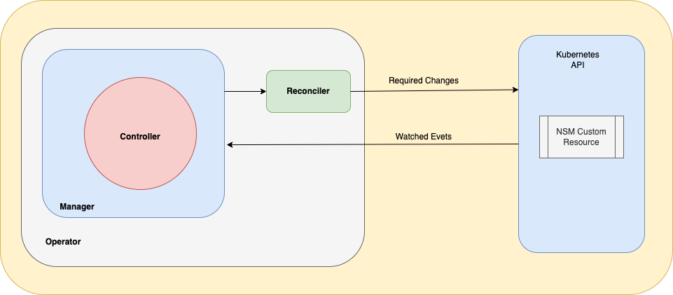

# Operator Design Reference

The goal of an operator in general is to provide high level api extensions and new controllers to kubernetes in order to enable what we call cloud native deployment and management of specific applications. 

### So what is a high level api?

This is a software api or, more precisely, api endpoint that is added to the native kubernetes api by extending it. That is done through the resource called `Custom Resource Definition` or as commonly known by its acronymn `CRD`. With that kind available in kubernetes we define new kinds. Those new kinds will be a "template" for our custom resources. We have one CRD called NSM for this operator that can hold all the configurations for a Network Service Mesh infrastucture, deploy it and manage it. There is a section below that goes in its details.

If you want to know more about kubernetes api extensions and CRDs plese check [here](https://kubernetes.io/docs/concepts/extend-kubernetes/api-extension/custom-resources/)

### What is Cloud Native?

From: [CNCF Cloud Native Definition](https://github.com/cncf/toc/blob/main/DEFINITION.md)

---
Cloud native technologies empower organizations to build and run scalable applications in modern, dynamic environments such as public, private, and hybrid clouds. Containers, service meshes, microservices, immutable infrastructure, and declarative APIs exemplify this approach.

These techniques enable loosely coupled systems that are resilient, manageable, and observable. Combined with robust automation, they allow engineers to make high-impact changes frequently and predictably with minimal toil.

The Cloud Native Computing Foundation seeks to drive adoption of this paradigm by fostering and sustaining an ecosystem of open source, vendor-neutral projects. We democratize state-of-the-art patterns to make these innovations accessible for everyone.

---

A few highlights that we aim to achieve with an operator:

### Loosely coupled systems

One controller for one Custom Resource Definition. Integration based on dependency graphs and each microservice or workload can have its dedicated operator to deploy, upgrade, monitor, manage and perform on the fly adjustments.

### Resilient

When mature enough an operator can detect specific failure and anomalous behaviors beforehand and act on them.

### Manageable

The upgrade lifecycle of an application can be fully owned by an operator. Its upgrade path can be predicted and coded in software with all the intelligence to upgrade without disruption.

### Observable

The Operator Framework on which this project is based brings essential metrics exposure tooling that can leverage the presence of Prometheus to expose application key metrics for monitoring and performance analysis.

### Robust Automation

Being written in Golang there is no limitations to what an operator can do. This is quite different from using tools such as helm, ansible or other automation stacks. 

### Minimal Toil

With all the other elements in place repetitive tasks can be eliminated and let for the operator to perform no matter what they are.

# Operator Scope in Kubernetes

CRDs are cluster scoped. That means they are not namespaced and are available to be installed in all namespaces. We chose to have a singleton strategy for NSM. The `nsm` namespace should be the place to deploy the nsm-operator and custom resource in order to have the NSM infrastructure installed. That means that the operator will be deployed in that namespace and will be watching that specific namespace for custom resources named `NSM`. Once an engineer with the proper credentials creates that new custom resource on the `NSM` namespace the operator will trigger its reconciler function to create all the necessary resources for NSM. Check the item `Primary and Secondary Resources` below.

# CRD and Types

You can find the golang definition for the NSM types on apis/nsm/v1alpha1/nsm_types.go. This file contains the main NSM object as well as its components. You can find [NSMSpec](https://github.com/networkservicemesh/nsm-operator/blob/d6009d1e314aaea7d28a9683e4fe0dd9ba88866a/apis/nsm/v1alpha1/nsm_types.go#L33-L40) and [NSMStatus](https://github.com/networkservicemesh/nsm-operator/blob/d6009d1e314aaea7d28a9683e4fe0dd9ba88866a/apis/nsm/v1alpha1/nsm_types.go#L55-L58). Both are common fields among all kubernertes resources. And all extra types are auxiliary types. For example the [forwarder](https://github.com/networkservicemesh/nsm-operator/blob/d6009d1e314aaea7d28a9683e4fe0dd9ba88866a/apis/nsm/v1alpha1/nsm_types.go#L24-L30) type that holds forwarder configuration for `NSM`.

# Primary and Secondary Resources

The primary resource will always be the Custom Resource we're creating. In this case it is the NSM resource. You may find an example under config/samples/nsm_v1alpha1_nsm.yaml. Once it's created it becomes the owner of all the secondary resources.

The secondary resources will be NSM deployments, daemonsets, services and any other native Kubernetes resource required to run NSM as a platform service. As those are owned by the primary one there is garbage collection available on Kubernetes to delete them if the primary one is deleted. This means that if we delete the NSM CR all the secondary resources get deleted by Kubernetes itself because the parent resource was deleted.

# External Resources

The object ownership embedded in Kubernetes doesn't exist outside the scope of a cluster but external resources such as cloud services, networking devices, other apis etc. can also be managed by the operator and enter the roadmap of this project.

# Controller and Reconciler Function

The controller in a few words is a control loop that keeps watching for events related to a certain object. In our case the controller will be watching events about NSM CR deployments. The controller will always create a "job" in it's work queue that will trigger the reconciler function every time an event about NSM comes in.

The controller is provided by the [controller-runtime](https://github.com/kubernetes-sigs/controller-runtime) project and is imported to this project and started by the what we call the "manager" that you can find in the main.go file. What we add is our business logic to a [reconciler](https://github.com/networkservicemesh/nsm-operator/blob/d6009d1e314aaea7d28a9683e4fe0dd9ba88866a/controllers/nsm/controller.go#L59) function and [register that function with the manager](https://github.com/networkservicemesh/nsm-operator/blob/d6009d1e314aaea7d28a9683e4fe0dd9ba88866a/controllers/nsm/controller.go#L128-L135) to allow the controller triggering reconciliation process upon events.

Here is a simple diagram explaining the communication between the operator deployment with controller and its reconciler and the kubernetes API.

---