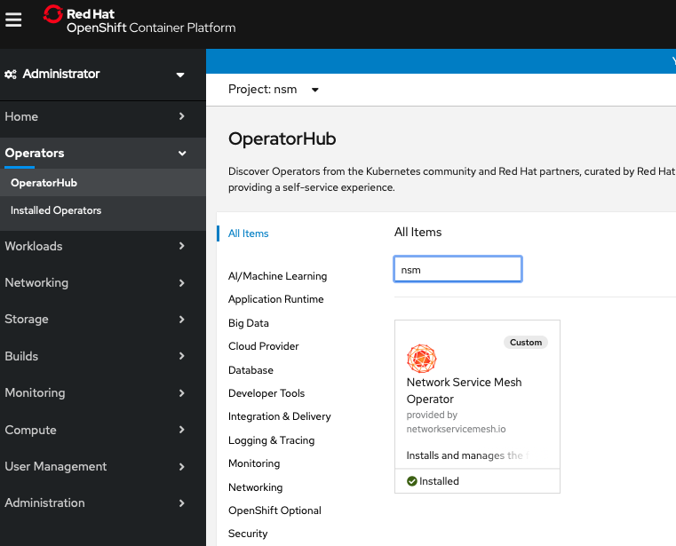
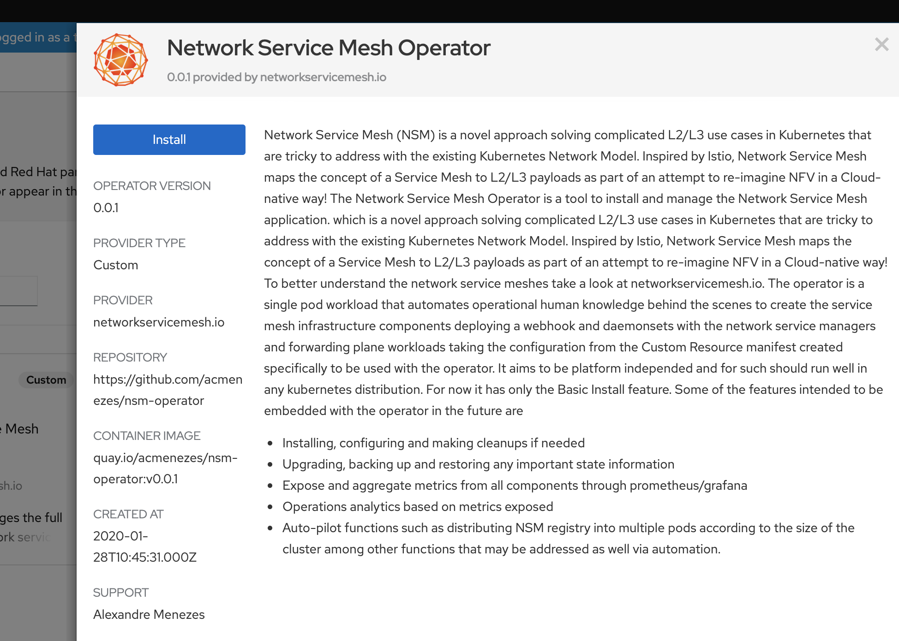
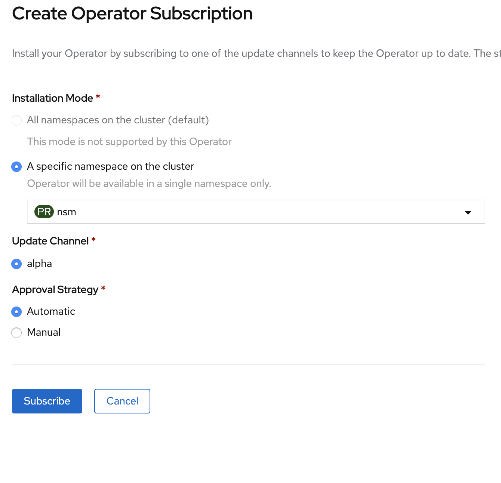
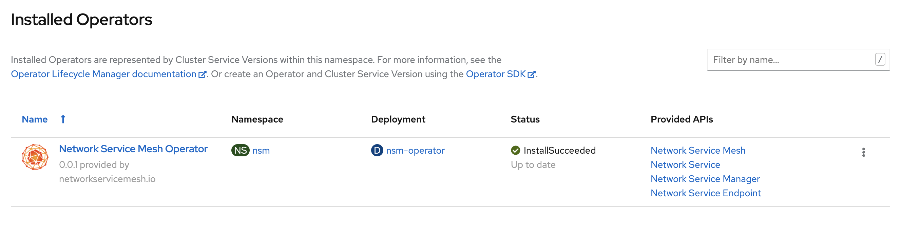
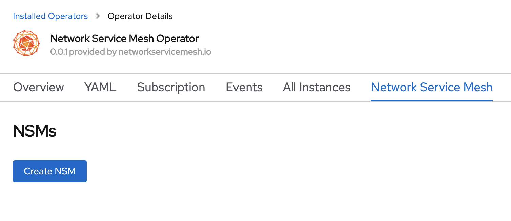
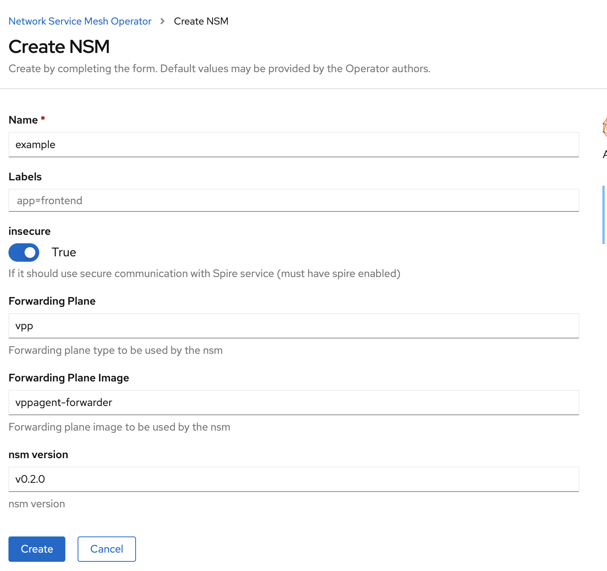
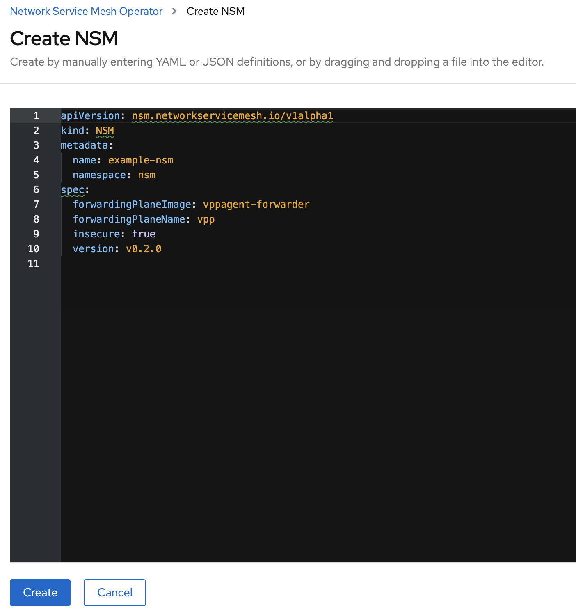
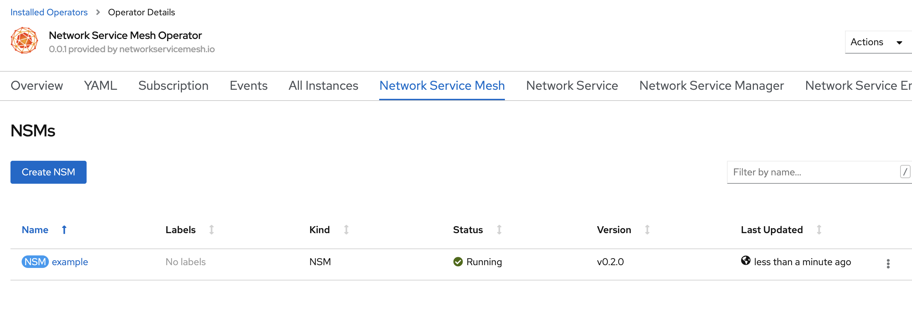
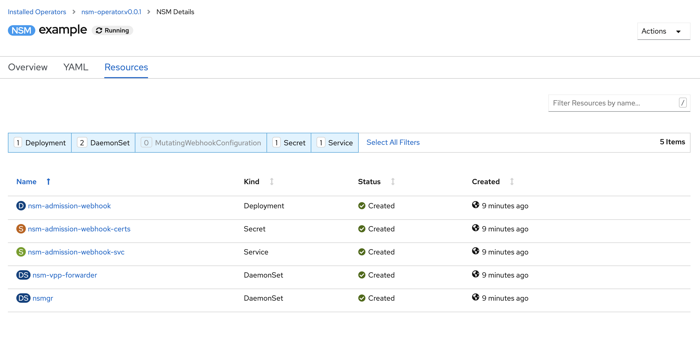

## Openshift Embedded Operator Hub

First let's create a namespace named nsm:

```
oc create namespace nsm
```

Now after logging in to the Openshift console, clicking on OperatorHub we can filter by nsm on the text box and we will find the nsm operator badge.



After clicking on it we have the presentation page with the install button. Let's run it. Click install!



We land on the subscription home page. Here is were you subscribe to the nsm operator offered by the Red Hat's Openshift OperatorHub. Pick the nsm namespace and let the defaults on the other options. Finally click subscribe.



After a while we should be able to see the operator with the Status `InstallSuceeded`. Then click on the Network Service Mesh among the Provided APIs.



You will see a button saying Create NSM. Let's click it!



Below we present 2 methods that can be used with the embedded openshift OperatorHub. The edit form method and the yaml. Both are good. Choose one and go forward. At this point in time the default choices are the only supported. Let's click create.

Edit form method:

YAML create method:


After clicking create, a few seconds after we should have a NSM enabled cluster ready to be configure with new network services. Check if it got to the `running` Status.



And finally clicking on the created nsm object and on the Resources tab we can check it's components running on Openshift:



Now to run network services check the examples on the [usage page](usage.md).